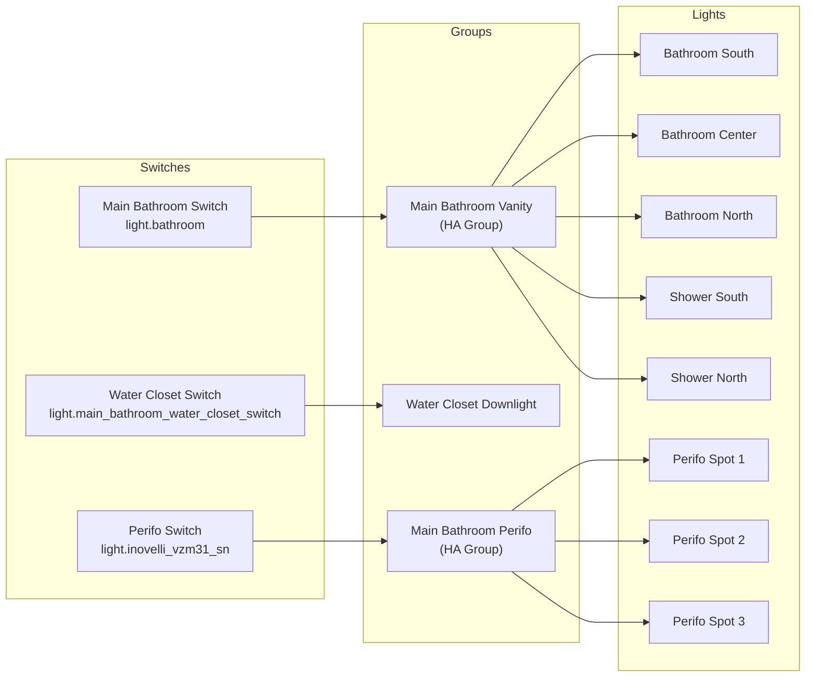
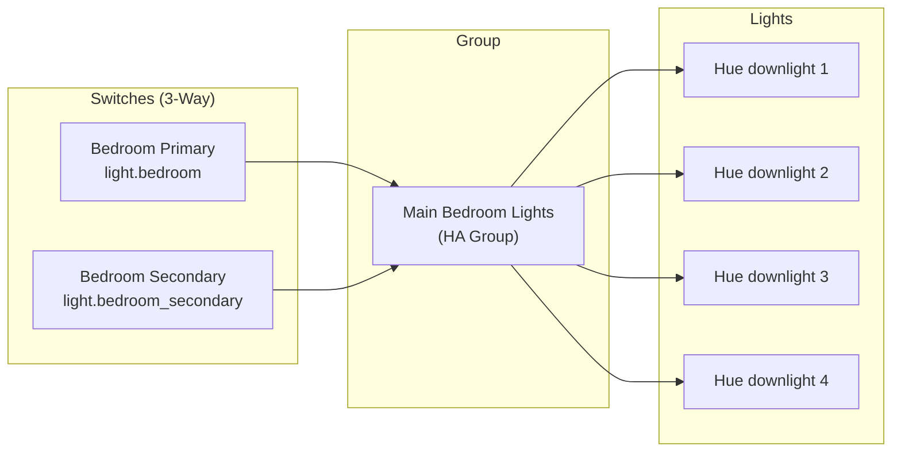
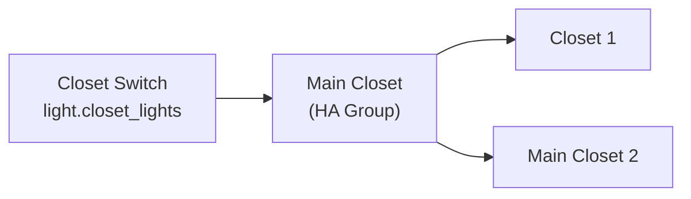
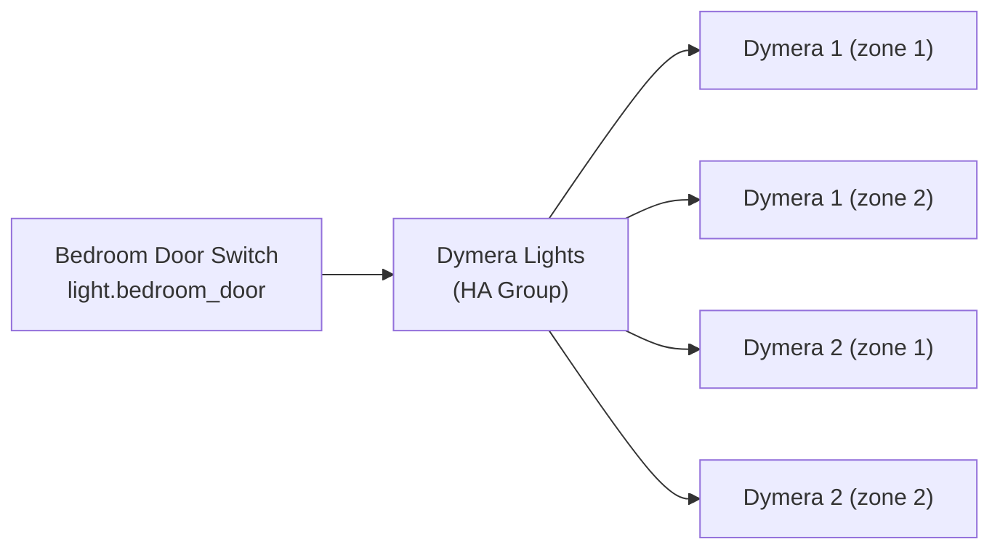
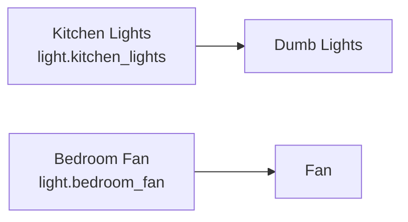

# Inovelli Switch to Hue Light Inventory

This document maps Inovelli Blue switches (ZHA) to their target Hue lights/groups.

## Diagrams by Room

### Main Bathroom



### Main Bedroom



### Main Closet



### Bedroom Door / Dymera



### Other Switches (Direct Load)



## Automation Summary

| Automation | Switch Entity | Device | Target Light | Status |
|------------|---------------|--------|--------------|--------|
| Water Closet Switch | `light.main_bathroom_water_closet_switch` | [c3a30413...](https://home.jaxon.cloud/config/devices/device/c3a304139f53a04585554e69356b40a0) | `light.hue_color_downlight_1_3` | ✅ Working |
| Main Bathroom Switch | `light.bathroom` | [0d0e7c87...](https://home.jaxon.cloud/config/devices/device/0d0e7c87550b66a1c07df4344ce9349e) | `light.main_bathroom_vanity` | ✅ Configured |
| Main Bathroom Perifo | `light.inovelli_vzm31_sn` | [3f1f8dfa...](https://home.jaxon.cloud/config/devices/device/3f1f8dfa89f98cb2c60583343be18116) | `light.main_bathroom_perifo` | ✅ Configured |
| Main Bedroom Primary | `light.bedroom` | [a4725faf...](https://home.jaxon.cloud/config/devices/device/a4725fafbb5c890f438fdbb217e5a065) | `light.main_bedroom_lights` | ✅ Configured |
| Main Bedroom Secondary | `light.bedroom_secondary` | [239dc029...](https://home.jaxon.cloud/config/devices/device/239dc029b9f00153b39c5de09bbbb95a) | `light.main_bedroom_lights` | ✅ Configured |
| Main Closet Switch | `light.closet_lights` | [412a5211...](https://home.jaxon.cloud/config/devices/device/412a521173c99cf910da6d89f4914475) | `light.main_closet` | ✅ Configured |
| Bedroom Door Switch | `light.bedroom_door` | [1e966c43...](https://home.jaxon.cloud/config/devices/device/1e966c43e80dfef9fa3847bea99dff45) | `light.dymera_lights` | ✅ Configured |
| Kitchen Lights | `light.kitchen_lights` | - | Direct load (dumb) | N/A |
| Bedroom Fan | `light.bedroom_fan` | [fdc5060f...](https://home.jaxon.cloud/config/devices/device/fdc5060fa8763ce7b32ed1286a768c42) | Direct load | N/A |

## HA Light Groups Created

```yaml
light:
  - platform: group
    name: Main Bathroom Vanity
    entities:
      - light.hue_color_downlight_5_3   # Bathroom South
      - light.hue_color_downlight_8     # Shower South
      - light.hue_color_downlight_6     # Shower North
      - light.hue_color_downlight_7     # Bathroom Center
      - light.hue_color_downlight_5_2   # Bathroom North

  - platform: group
    name: Main Bathroom Perifo
    entities:
      - light.perifo_cylinder_spot_1
      - light.perifo_cylinder_spot_2
      - light.perifo_cylinder_spot_3

  - platform: group
    name: Main Closet
    entities:
      - light.hue_color_downlight_1_2   # Closet 1
      - light.hue_color_downlight_5_5   # Main Closet 2

  - platform: group
    name: Main Bedroom Lights
    entities:
      - light.hue_color_downlight_4_2   # Hue color downlight 4
      - light.hue_color_downlight_3_2   # Hue color downlight 2
      - light.hue_color_downlight_1_4   # Hue color downlight 1
      - light.hue_color_downlight_2_2   # Hue color downlight 3

  - platform: group
    name: Dymera Lights
    entities:
      - light.dymera_1
      - light.dymera_1_2
      - light.dymera_2
      - light.dymera_2_2
```

## Notes

### 3-Way Switch Configuration
- Main Bedroom has two Inovelli switches configured as "Three Way AUX"
- Both switches trigger the same automation to control `light.main_bedroom`
- Physical sync happens via traveler wire; LED sync would need additional automation

### Dymera Lights (Pending)
The Dymera lights have dual controls per fixture:
- `light.dymera_1` and `light.dymera_1_2`
- `light.dymera_2` and `light.dymera_2_2`

Need to determine which entities to target when bedroom door switch is added.

### Blueprint Used
All automations use `jax/inovelli_hue.yaml` blueprint which:
- Listens for `zha_event` from Inovelli device
- Maps button presses to Hue light actions
- Supports dimming, on/off transitions
- Optional final sync of brightness on release
